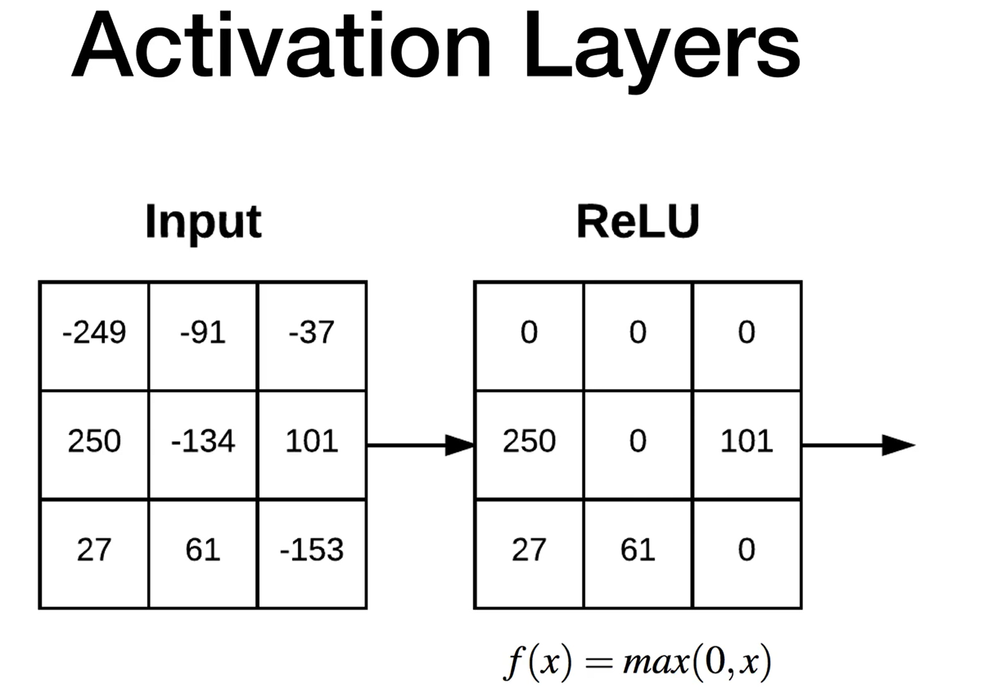

# feedforward-neural-network

1. Pooling layer will reduce the spatial dimensions of the given input
2. Batch normalization fit in the certain area of the network. Which should help stabalized trainig

stack layers together to form a CNN:
INPUT > CONV > RELU > FC > SOFTMAX

- If the stride is 2, we are not learning anything. Skipping the value too much
- while increasing the value of stride, you are reducing the volume
- By using zero padding we can preserve the output dimensions

Batch Normalization:
    will allow us to train our model in most stable manner. It's basic scalling in normalization
1. Performing this batch normalization makes our training more stable
2. Batch normalization tipycally allow you to train your network in less no of epochs
3. Batch normalization typically go after the activation
INPUT > CONV > RELU > BN

